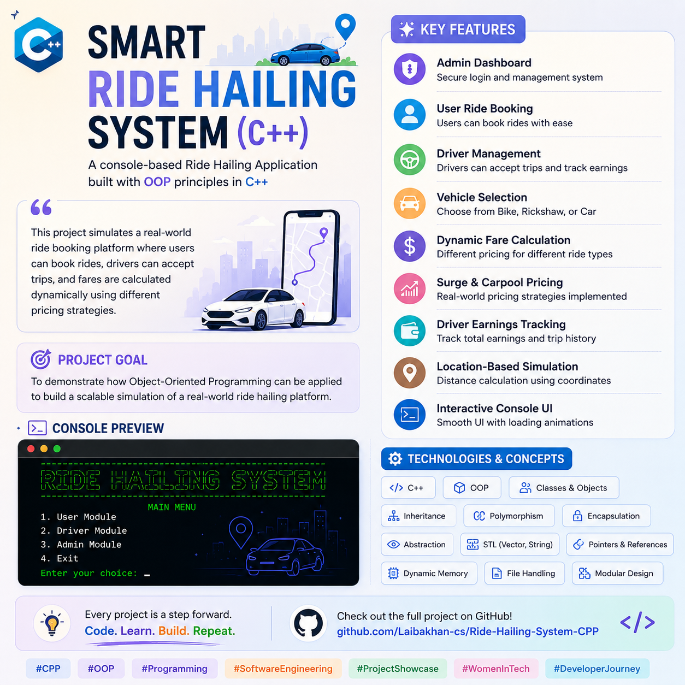

#  Smart Ride Hailing System (C++)

  A Console-Based Ride Hailing Application Developed Using Object-Oriented Programming (OOP) Concepts in C++

---

##  Features

- Admin Dashboard with Secure Login
- User Ride Booking System
- Driver Management Module
- Vehicle Selection (Bike, Rickshaw, Car)
- Dynamic Fare Calculation
- Surge Pricing Support
- Carpool Fare Support
- Driver Earnings Tracking
- Location-Based Distance Calculation
- Interactive Console UI

---

##  Technologies Used

- C++
- Object-Oriented Programming (OOP)
- STL (Vector, String)
- Dynamic Memory Management
- Polymorphism
- Inheritance
- Encapsulation
- Abstraction

---

##  Project Goal

This project simulates a real-world ride hailing platform where users can request rides, drivers can manage trips, and fares are calculated dynamically using different pricing strategies.

---

##  Concepts Implemented

✔ Classes & Objects

✔ Encapsulation

✔ Inheritance

✔ Polymorphism

✔ Abstraction

✔ Constructor Initializer Lists

✔ Pointers & References

✔ Dynamic Memory Management

---

### 💡 Learning Outcome

This project helped me strengthen my understanding of Object-Oriented Programming and how software engineering concepts can be applied to solve real-world problems.

⭐ If you like this project, don't forget to star the repository!
